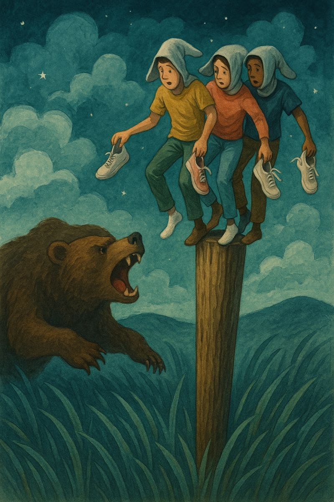

Soñé que un oso enorme nos perseguía. No corría con furia, sino con la lenta inevitabilidad de lo que te supera en tamaño y tiempo. Nosotros —tres figuras descalzas y desconcertadas— huíamos a través de un campus fantasma, entre edificios sin terminar, con rótulos de presupuestos agotados y el eco de promesas institucionales.

En la desesperación, trepamos un poste. No era un árbol, ni una torre, ni una columna: un poste de madera, estrecho, mal lijado, como improvisado por alguien que necesitaba parecer que construía algo. Nos subimos los tres, de pie, haciendo equilibrios. Cada uno con sus zapatillas en la mano. Un calcetín puesto. El otro, tapándonos la cabeza. Así de literal.

Debajo, el oso nos miraba. No rugía. Esperaba. Como si supiera que no aguantaríamos mucho tiempo más sobre ese poste maldito. Y tenía razón.
No podíamos avanzar, porque no había adónde ir. Arriba no hay siguiente escalón. Abajo, el oso. A los lados, el silencio de un sistema que se alimenta de la espera.

Sabíamos que el poste era el único lugar donde no nos devoraban todavía. Un lugar incómodo, precario, ridículo incluso. Como estar acreditado a catedrático en la Universidad de Málaga, pero sin plaza. Como haber cumplido cada requisito, entregado cada papel, subido cada peldaño, solo para encontrarte con que ya no se convocan plazas. Ni se sabe cuándo se convocarán. Ni si queda dinero para que se convoquen alguna vez.

Nos llegaban rumores desde el suelo. Que no hay presupuesto. Que la Junta de Andalucía aprieta. Que la universidad ha gastado en obras y edificios que nadie pidió. Que no hay plan. Que no hay fecha. Que aguantes. Que equilibres. Que no mires abajo.

En lo alto del poste, la universidad es un juego de malabares. De méritos invisibles. De tiempos rotos. De calcetines fuera de lugar.

Y mientras tanto, el oso ...

