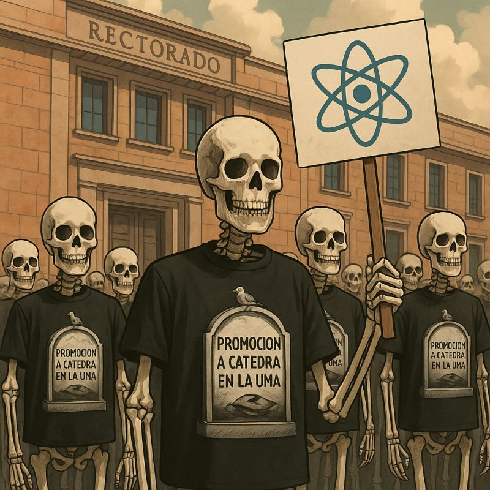

## Los que esperaban

En una ciudad universitaria, de pasillos largos y promesas aún más largas, se levantaba un edificio de piedra noble al que todos llamaban “el Rectorado”.
Allí, frente a su puerta principal, comenzaron a reunirse un día figuras que pocos recordaban haber visto antes. Eran esqueletos.

No venían del cementerio, sino de las aulas, de los laboratorios, de los expedientes congelados en un limbo administrativo.

 No gritaban. No agitaban pancartas.

 Simplemente estaban ahí, con camisetas negras que llevaban estampada una lápida: "Promoción a cátedra en la UMA".

Habían sido docentes, investigadores, tutores, coordinadores de máster.

Habían pasado años cumpliendo requisitos, obteniendo sexenios, liderando proyectos, superando evaluaciones externas.

Habían conseguido la acreditación nacional a catedrático.

Y luego… habían esperado.
 Un año.
 Dos.
 Tres.
 Algunos ya no sabían cuánto.

Otros ya no recordaban si aún estaban vivos… o si ya eran parte del mobiliario invisible de una universidad detenida.

Los esqueletos no pedían privilegios. Solo pedían tiempo justo. Un plazo. Un compromiso. Una escalera en vez de un mausoleo.

Pero desde dentro del rectorado solo llegaban fórmulas ambiguas:
 “Cuando se pueda”.
 “Estamos en ello”.
 “Depende del presupuesto”.
 Y las puertas seguían cerradas.

Entonces uno de los esqueletos, el más delgado, habló en voz baja:
— No somos los restos del pasado.
 — Somos el futuro esperando demasiado.

Y los demás lo escucharon.
 Y algunos vivos también.

Porque no se puede construir una universidad pública de calidad sobre la espera infinita de quienes ya han demostrado su valía.

Ese día, los esqueletos no se disolvieron.
 Pero empezaron a contar su historia.
 
Y la universidad, si aún quiere tener alma, tendrá que escucharla.
