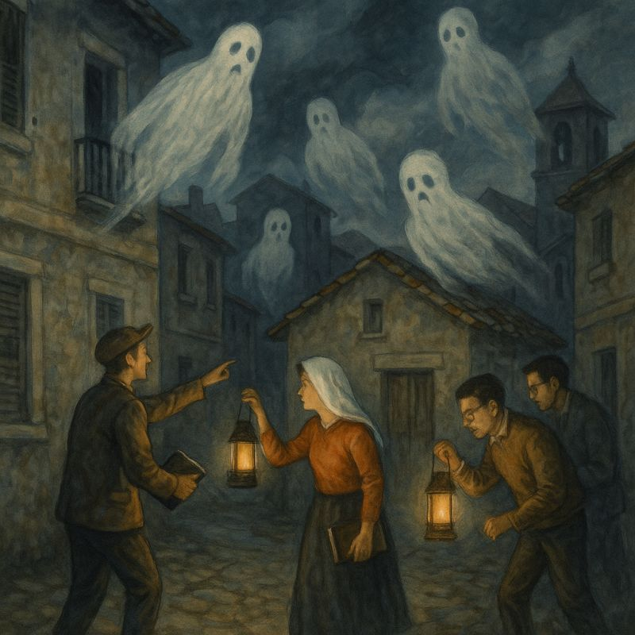

## El pueblo de los fantasmas

Había una vez un pueblo antiguo, de calles estrechas y edificios de piedra desgastada. Un pueblo con historia, sí, pero también con algo más: fantasmas.

No eran espectros aterradores. No gritaban, no rompían cristales. Solo habitaban. En las casas grandes y en las pequeñas, en el archivo, en la plaza, en las aulas vacías. Estaban en los rincones, en las salas de reuniones, entre expedientes sin firmar y promesas sin cumplir.

La gente del pueblo decía que era normal. Que esos fantasmas siempre habían estado ahí. Que venían de un gobierno anterior, uno que hizo grandes obras, dejó muchos muros sin pintar… y muchas puertas cerradas. Pero nadie hacía nada. Solo se murmuraba: "mejor no molestar", "no es el momento", "ya pasará".

Muchos habitantes, aunque molestos, preferían no mirar. Seguían trabajando, con la vista baja y la espalda tensa. “No hay dinero”, decían. “Es complicado”. “Ya nos tocará”.

Pero un pequeño grupo decidió algo distinto. No eran más valientes, solo estaban cansados. Cansados de esperar una plaza, una respuesta, una señal de que su esfuerzo valía. De que la excelencia no debía pagarse con resignación. Así que, aunque asustados, comenzaron a moverse.

Entraron en los archivos polvorientos, donde dormían documentos olvidados por años. Abrieron cajones, iluminaron esquinas oscuras, preguntaron en voz alta lo que nadie quería decir. Hablaron de planificación, de derechos, de justicia. De devolverle al pueblo lo que era del pueblo: una universidad pública de calidad, con futuro, con equidad.

Los fantasmas, entonces, empezaron a cambiar. No desaparecieron de golpe, pero ya no parecían tan sólidos. Algunos incluso se desvanecían cuando se decía la verdad en alto.

Y fue entonces cuando lo comprendieron:

los fantasmas no eran solo del pasado.

 
 
También estaban hechos del silencio del presente.

 
 
De la inacción.

 
 
De cada "no es mi problema".

Para que el pueblo volviera a vivir sin miedo, no bastaba con que unos pocos lucharan.

Todos debían despertar.

 

Mirar a los ojos al pasado, y elegir algo distinto para el futuro.

Feliz 1 de Mayo, ¡levantémonos!

